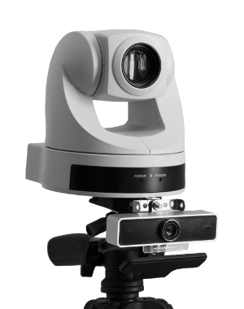

Camera Layout
=============

For best results, the overview camera should be co-located with the PTZ
camera. For ease of calibration, position both cameras in the rear
centre of the venue.

   PTZ and Overview Camera mounting
