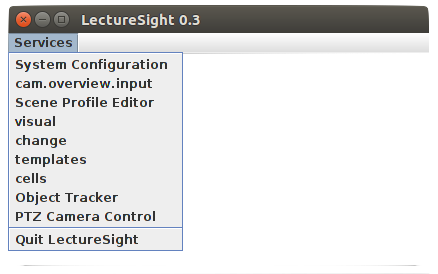

Start LectureSight
==================

    With the default configuration, LectureSight will use the video
    device ``/dev/video0`` as overview camera with a resolution of
    320x240, and a simulated (dummy) PTZ camera.

Change to the LectureSight directory:

::

    cd /opt/ls

Review the default configuration:

::

    nano conf/lecturesight.properties

Start LectureSight:

::

    ./bin/start_lecturesight.sh

Console
-------

The `Console <../core/console>`__ shell will appear, followed by
start-up INFO log entries:

::

    ____________________________
    Welcome to Apache Felix Gogo

    g! 16:04:16 INFO: ScriptingStub.activate() -- Activated
    16:04:16 INFO: ConfigurationServiceImpl.<init>() -- LectureSight version 0.3
    ...

Type ``help`` to see the available `console
commands <../core/console#commands>`__.

GUI
---

You will see the main application window appear. The **Services** menu
should be populated with a number of entries.

   LectureSight main window

Shutdown
--------

To shut down LectureSight, press ``Ctrl-C`` at the console, or use the
console command ``stop 0``, or select **Services \| Quit LectureSight**
in the GUI.

Troubleshooting
---------------

OpenCL
~~~~~~

If you only see the entry **System configuration**, it is possible that
the system was not able to initialize the `OpenCL <../core/opencl>`__
platform and `GPU <../hardware/server/#gpu>`__ successfully.

Look for the OpenCL device reports in the console, for example:

::

    OpenCL device report:

    NVIDIA Corporation NVS 315 (driver version: 375.66)

    Compute units :  1 at 1046 MHz max

    Memories :  global   : 964.4375 MB
    constant : 64.0 KB
    local    : 48.0 KB

    Workgroups :  1024 threads max in 3 dimensions
    2D Image size :  16384x16384 max
    Work item sizes:  1024 1024 64

If you don't find an OpenCL device report in the console, this means
that the OpenCL service was not able to find and initalize the OpenCL
platform. In this case check the installation of the graphics card
driver.

Bundle startup
~~~~~~~~~~~~~~

At the console, type:

::

    lb

to list installed bundles. The set of system bundles will be listed,
followed by LectureSight bundles. A status of ``Resolved`` or
``Installed`` indicates that the bundle has not started correctly. For
example:

::

    g! lb
    START LEVEL 2
    ID|State      |Level|Name
     0|Active     |    0|System Bundle (4.2.0)
     1|Active     |    1|Apache Felix Configuration Admin Service (1.2.8)
    ...
    38|Active     |    1|LectureSight Object Tracker API (0.3.0)
    39|Active     |    1|LectureSight GUI API (0.3.0)
    40|Installed  |    1|LectureSight Video4Linux FrameSource (0.3.0)

You can attempt to start the bundle to get more information about the
cause of the failure. For example:

::

    g! start 40
    org.osgi.framework.BundleException: Unresolved constraint in bundle cv.lecturesight.framesource.v4l [40]: No matching native libraries found.
