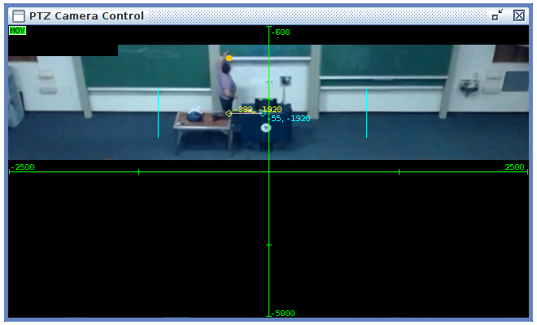
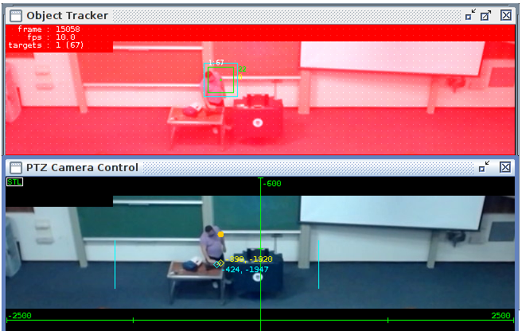

PTZ Camera Control
==================

The **PTZ Camera Control** display is used for verifying camera
calibration and movement, and optimising camera movement when tracking.

Verifying Calibration
---------------------

   PTZ Camera Control

The cyan lines show the frame width of the PTZ Camera's field of view at
the configured zoom level.

Optimising tracking performance
-------------------------------

   PTZ Camera Control and Object Tracker

The orange dot shows the target position provided by the Steering Worker
by the Camera Operator. The yellow diamond shows the target position for
the PTZ Camera, and the cyan diamond shows the actual camera position.
