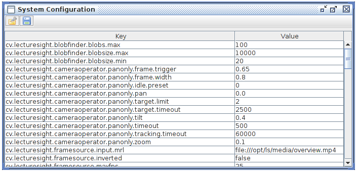

System Configuration
====================

The **System Configuration** table can be used to modify system
configuration properties. Edit the values by clicking on them and then
typing a new value.

Some configuration parameters, including those for video analysis, are
interactive in that changes on them take effect as soon as you hit enter
after editing a values. Other properties such as the path to the
overview camera video device, are used only at system start.

   System Configuration
