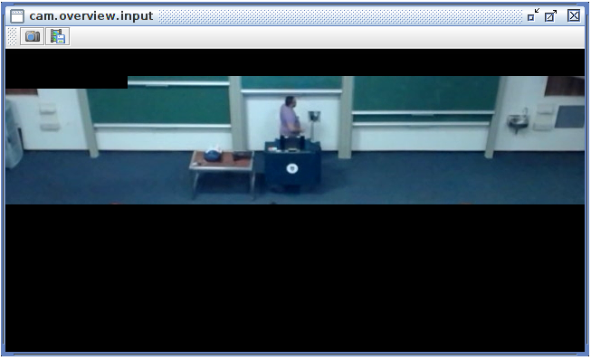

Overview Camera
===============

The Overview Camera display is shown on the Services menu as
**cam.overview.input**. It shows the input from the overview camera with
the active scene profile mask applied (ignore masks are shown as black
regions).

   Overview Camera display
