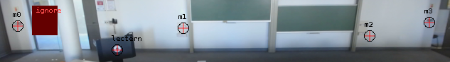

Scene Profile Editor
====================

The **Scene Profile Editor** allows zones and points to be defined which
affect the video analysis and camera calibration.

Ignore Zones
------------

Ignore Zones are masked out from the input frame before video analysis.
Add ignore regions to mask areas of the overview input that are not of
interest for tracking, for example audience seating, doorways, or
projector screens.

.. figure:: ../images/ls_scene_profile_editor.png
   :alt: Scene Profile Editor

   Scene Profile Editor

Calibration Markers
-------------------

Calibration Markers identify specific points on the overview image.
These can be used for `marker
calibration <../config/calibration#marker-calibration>`__, or for later
reference (for example to verify that the overview camera has not moved
since installation).

   Calibration markers

Other zone types
----------------

**Tracking Zones**, **Trigger Zones** and **Measure Zones** are not
presently used by LectureSight.

Create profile
--------------

Note that the default profile cannot be saved, so to use a custom
profile, create a new profile first.

When you are done creating the profile, click the **Save** button to
save the profile to a file in the ``profiles`` directory. Every time you
save a profile or choose one from the dropdown, the profile will be
activated so you can see how the system performs when the profile is
active.

To use your profile permanently, set the name of the active profile to
use in ``lecturesight.properties``

::

    cv.lecturesight.profile.manager.active.profile=myprofile
