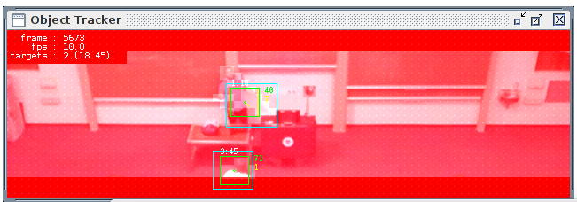

# Object Tracker

The **Object Tracker** display is produced by the [Video Analysis](../modules/videoanalysis.md) module, and shows the targets currently identified for possible camera tracking.

## Single Target

## Multiple Targets

## Other displays

The Video Analysis module also produces four other displays:
 
 * **visual**
 * **change**
 * **cells**
 * **templates**
 
